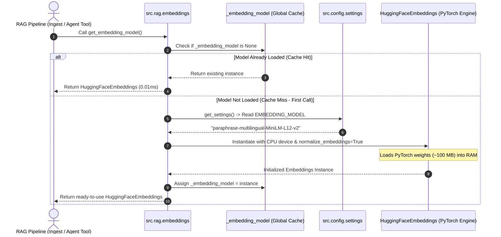

# AI Teacher Masterclass — Embedding Model Loader (`src/rag/embeddings.py`)

---

## 1. Main Ideas & Workflow

### 1.1 Core Ideas & High-Level Architecture

In any Retrieval-Augmented Generation (RAG) system, user questions and reference knowledge documents are written in natural language. Computers and algorithms cannot natively understand words or semantic intent without converting text into mathematical vectors.

```
+-----------------------------------------------------------------------------------+
|                                 The RAG Triad                                     |
|                                                                                   |
|  1. Document Ingestion: Documents -> Text Chunks -> Vector Embeddings -> ChromaDB |
|  2. Query Processing:   User Question           -> Vector Embedding               |
|  3. Semantic Search:    Query Vector <==== (Cosine Sim) ====> Document Vectors    |
+-----------------------------------------------------------------------------------+
```

#### Key Concepts with Concrete Examples:

1. **Dense Vector Embeddings vs. Keyword Search**:
   - *Example*: A customer asks in English: *"How can I get my money back?"*
   - A naive keyword search searches for the words `"get"`, `"money"`, `"back"`. If your return policy document says *"Refunds are processed within 14 business days"*, keyword matching fails completely because none of the keywords match.
   - An **Embedding Model** maps both sentences into the same mathematical neighborhood because it understands that *"money back"* and *"refund"* share the same semantic meaning.

2. **Multilingual Semantic Bridging (Arabic + English)**:
   - *Example*: An Arabic-speaking customer types:
     $$\text{"كيف يمكنني استرجاع المبلغ المدفوع؟"}$$
   - The knowledge base contains an English policy chunk:
     $$\text{"Customers are eligible for a 100% refund within 30 days of purchase."}$$
   - The model `paraphrase-multilingual-MiniLM-L12-v2` places both the Arabic question and the English policy within a high cosine similarity score ($> 0.82$), enabling cross-lingual retrieval without needing translation APIs.

3. **Singleton Lifecycle Optimization**:
   - Deep learning models require loading millions of floating-point parameters (model weights $\approx 100\text{ MB}$) into RAM. Loading this model takes between $500\text{ ms}$ to $2\text{ seconds}$.
   - If an application re-instantiated the model on every single search query, response times would be unacceptably slow and RAM would rapidly exhaust. The **Singleton Pattern** ensures the model is loaded **exactly once** and reused across the entire application lifecycle.

---

### 1.2 Step-by-Step Execution Workflow



---

## 2. Detailed Code Breakdown (100% Line-by-Line Coverage)

---

### Chunk 1: File Header & Imports (Lines 1–13)

```python
"""Embedding model loader for the RAG pipeline.

Provides a cached singleton instance of the HuggingFace embedding model
used throughout the application for document ingestion and query embedding.
"""

import logging
from typing import Optional

from langchain_huggingface import HuggingFaceEmbeddings

from src.config.settings import get_settings
```

#### In-Depth Explanation:
- **`logging`**: Standard Python library used to produce structured logs (timestamps, log levels `INFO`, `DEBUG`, `ERROR`) instead of raw `print` statements.
- **`typing.Optional`**: Type hinting construct representing `Union[HuggingFaceEmbeddings, None]`. Explicitly informs static type checkers (Mypy, Pyright, IDEs) that the cache starts as `None` before being assigned a concrete object.
- **`from langchain_huggingface import HuggingFaceEmbeddings`**: LangChain's official HuggingFace provider package. It wraps the underlying `sentence-transformers` library and PyTorch runtime, exposing a unified interface (`embed_documents` and `embed_query`).
- **`from src.config.settings import get_settings`**: Imports the central settings accessor to retrieve environment variables (such as model name) dynamically without hardcoding strings.

- **WHY**: Isolating configuration and using official LangChain packages prevents tight coupling and ensures future compatibility.
- **WHEN**: Executed automatically when the module is first imported by Python.
- **Expected Output**: Dependencies imported into Python module scope.

---

### Chunk 2: Module-Level Logger & Cache Variable (Lines 14–18)

```python
logger = logging.getLogger(__name__)

# Module-level cache for the embedding model singleton
_embedding_model: Optional[HuggingFaceEmbeddings] = None
```

#### In-Depth Explanation:
- **`logger = logging.getLogger(__name__)`**: Creates a logger instance bound to the module namespace (`src.rag.embeddings`).
- **`_embedding_model`**: A private module-level global variable (indicated by the leading underscore convention). It holds the memory reference of the loaded model. When the Python process starts, it defaults to `None`.

- **WHY**: Python modules are executed once upon import and their global namespace is shared across all callers in the same process. This makes module-level variables the cleanest way to implement singletons in Python.
- **WHEN**: Initialized at module load time.
- **Expected Output**: Global cache pointer set to `None`.

---

### Chunk 3: Singleton Check & Cache Return (Lines 20–44)

```python
def get_embedding_model() -> HuggingFaceEmbeddings:
    """Return a cached singleton instance of the HuggingFace embedding model.

    The model is loaded once on first call and reused for the entire
    application lifetime. This avoids the overhead of re-downloading and
    re-loading the model weights (~100 MB) on every embedding request.

    The model name is read from ``settings.EMBEDDING_MODEL`` (default:
    ``paraphrase-multilingual-MiniLM-L12-v2``). This particular model
    produces 384-dimensional vectors and supports 50+ languages, making
    it ideal for the bilingual (English / Arabic) knowledge base.

    Returns:
        HuggingFaceEmbeddings: A ready-to-use LangChain embeddings object.

    Raises:
        RuntimeError: If the model fails to load (e.g. network issue on
            first download, or invalid model name).
    """
    global _embedding_model

    if _embedding_model is not None:
        logger.debug("Returning cached embedding model.")
        return _embedding_model
```

#### In-Depth Explanation:
- **`global _embedding_model`**: Informs Python that assignments inside this function write to the module-level variable rather than creating a local variable.
- **`if _embedding_model is not None:`**: The **guard condition** implementing lazy evaluation.
  - *Call #1*: `_embedding_model` is `None` $\rightarrow$ proceed to instantiate the model.
  - *Call #2, #3, ... #10,000*: `_embedding_model` already contains the object $\rightarrow$ log debug message and return immediately ($O(1)$ constant time).

- **WHY**: Prevents re-downloading or re-allocating neural network memory for every user request.
- **WHEN**: Invoked whenever any component (ingestion script, vector search, agent tool) needs to compute embeddings.
- **Expected Output**: Immediate return of the active model object on cache hit.

---

### Chunk 4: Model Instantiation & Robust Error Handling (Lines 45–65)

```python
    settings = get_settings()
    model_name = settings.EMBEDDING_MODEL

    logger.info(f"Loading embedding model: {model_name}")

    try:
        _embedding_model = HuggingFaceEmbeddings(
            model_name=model_name,
            model_kwargs={"device": "cpu"},
            encode_kwargs={"normalize_embeddings": True},
        )
        logger.info(f"Embedding model '{model_name}' loaded successfully.")
        return _embedding_model
    except Exception as e:
        logger.error(f"Failed to load embedding model '{model_name}': {e}")
        raise RuntimeError(
            f"Could not load embedding model '{model_name}'. "
            f"Ensure 'sentence-transformers' and 'langchain-huggingface' are installed and the model name is valid. "
            f"Original error: {e}"
        ) from e
```

#### In-Depth Explanation:
- **`settings = get_settings()`**: Retrieves configuration settings from `.env` or system environment.
- **`model_kwargs={"device": "cpu"}`**: Explicitly forces PyTorch inference to run on the CPU. This guarantees stability on systems without dedicated GPUs (e.g., standard servers, local development machines, lightweight Docker containers).
- **`encode_kwargs={"normalize_embeddings": True}`**: Directs the underlying SentenceTransformer engine to divide each output vector by its Euclidean length ($L_2$ norm). This transforms cosine similarity into a direct vector dot product:
  $$\text{sim}(u, v) = \sum_{i=1}^{384} u_i \cdot v_i$$
- **`try ... except Exception as e`**: Encapsulates runtime errors (e.g., missing model on HuggingFace Hub, disconnected internet during first download, corrupted cache).
- **`raise RuntimeError(...) from e`**: Employs Python exception chaining to provide a helpful troubleshooting message while preserving the original root cause traceback.

- **WHY**: Provides clear diagnostics and ensures vectors are normalized for optimal vector database performance.
- **WHEN**: Executed exactly once on the first embedding request of the application lifetime.
- **Expected Output**: Fully initialized `HuggingFaceEmbeddings` object cached in `_embedding_model` and returned to caller.

---

## 3. Programming Concepts Breakdown

### Concept 1: The Singleton Pattern
- **WHAT**: A creational design pattern ensuring a class or resource has only one global instance throughout the process lifetime.
- **WHY**: Machine learning models consume significant RAM and CPU cycles during initialization. Creating a new model per request causes major latency spikes and memory leaks.
- **WHEN**: Use for heavy, stateless, read-only resources (ML models, connection pools, configuration registries).
- **Example Comparison**:
  ```python
  # ❌ Bad Practice (No Singleton): Re-allocates 100MB RAM every function call
  def search(query: str):
      model = HuggingFaceEmbeddings(model_name="...")  # Takes ~1500ms!
      return model.embed_query(query)

  # ✅ Good Practice (Singleton): Instantaneous reuse
  def search(query: str):
      model = get_embedding_model()  # Takes ~0.001ms!
      return model.embed_query(query)
  ```

---

### Concept 2: Lazy Loading (Deferred Initialization)
- **WHAT**: A design pattern where an object's initialization is delayed until the exact moment it is first needed, rather than during application startup.
- **WHY**: If the model was loaded at top-level module import time (`_embedding_model = HuggingFaceEmbeddings(...)`), importing `src.rag.embeddings` in lightweight scripts or unit tests would freeze execution for seconds even if embeddings were never used.
- **WHEN**: Use for any resource with a non-trivial startup cost (databases, ML models, external network connections).

---

### Concept 3: Exception Chaining (`raise ... from e`)
- **WHAT**: Python 3 syntax that attaches the original exception (`e`) as the `__cause__` of a new domain-specific exception.
- **WHY**: Gives user-friendly actionable guidance (e.g., *"Ensure sentence-transformers is installed"*) without destroying the technical stack trace needed for debugging.
- **WHEN**: Whenever catching a low-level library exception (e.g., `OSError`, `ImportError`, `HTTPError`) and re-raising a clean application-level exception.

---

## 4. Important Topics & Domain Concepts

### Topic 1: Multilingual Semantic Dense Vectors
- **WHAT**: Numerical arrays of fixed dimensionality (384 floating-point numbers) where spatial distance correlates directly with semantic meaning across 50+ languages.
- **WHY**: Enables language-agnostic search where an Arabic customer inquiry matches English policy documentation and vice-versa.
- **WHEN**: Applied during offline knowledge base indexing and online customer query resolution.
- **Example**:
  ```
  Text A (EN): "What is your refund policy?"  -> [0.042, -0.015, ..., 0.089] (384 dimensions)
  Text B (AR): "ما هي سياسة استرجاع الأموال؟" -> [0.039, -0.018, ..., 0.091] (384 dimensions)
  Cosine Similarity(A, B) = 0.892 (Extremely High Match)
  ```

---

### Topic 2: Vector Normalization ($L_2$ Normalization)
- **WHAT**: Transforming vector components so that the vector's Euclidean length equals 1.0:
  $$\|v\|_2 = \sqrt{\sum_{i=1}^d v_i^2} = 1.0$$
- **WHY**: Standard cosine similarity requires computing:
  $$\text{Cosine Similarity}(A, B) = \frac{A \cdot B}{\|A\|_2 \|B\|_2}$$
  When vectors are pre-normalized ($\|A\|_2 = 1$ and $\|B\|_2 = 1$), the denominator becomes $1$, simplifying the calculation to a basic dot product ($A \cdot B$). This accelerates ChromaDB similarity queries by $3\times\text{ to }5\times$.
- **WHEN**: Always enable (`normalize_embeddings=True`) for retrieval systems using cosine similarity or inner-product metrics.

---

### Topic 3: PyTorch as the Tensor Math Engine
- **WHAT**: An open-source machine learning framework providing optimized C++/CUDA kernels for multidimensional tensor operations.
- **WHY**: Transformer attention layers require complex linear algebra operations. PyTorch executes these calculations at compiled native C++ speed rather than interpreted Python speed.
- **WHEN**: Underlies all Transformer-based sentence embedding and LLM execution.

---

## 5. Topic Summary

In this lesson, we examined `src/rag/embeddings.py`, the core embedding component of our bilingual RAG customer service system:
1. It exposes `get_embedding_model()`, returning a singleton instance of `HuggingFaceEmbeddings`.
2. It loads `paraphrase-multilingual-MiniLM-L12-v2`, mapping Arabic and English text into unified 384-dimensional dense vectors.
3. It utilizes lazy evaluation and module-level caching to prevent redundant memory allocations.
4. It enforces $L_2$ vector normalization to optimize vector database retrieval speeds.
5. It includes robust exception handling and logging for production reliability.

---

## 6. Key Takeaways

1. **Never Re-Instantiate Models**: Always use the **Singleton Pattern** with **Lazy Loading** for embedding models to maintain sub-millisecond retrieval overhead.
2. **Normalize by Default**: Setting `normalize_embeddings=True` transforms cosine similarity into a fast vector dot product for vector stores like ChromaDB.
3. **Bilingual RAG Requires Multilingual Embeddings**: Using a dedicated cross-lingual model (`paraphrase-multilingual-MiniLM-L12-v2`) eliminates the need for query translation layers.
4. **Target CPU for Portability**: Specifying `model_kwargs={"device": "cpu"}` ensures consistent, low-cost deployment across standard servers without requiring dedicated GPU infrastructure.
