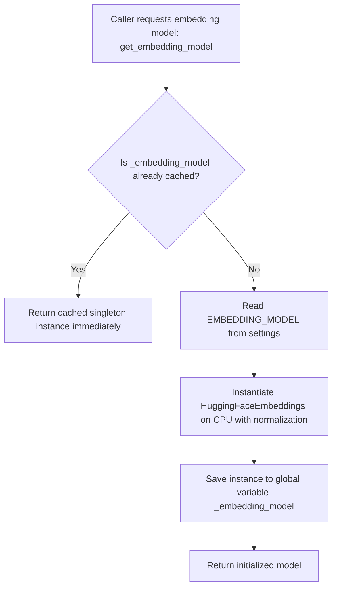

# Phase 4 — Step 4: Embedding Model Loader (`src/rag/embeddings.py`)

## 1. Main Ideas & Workflow

### Core Ideas
- **Dense Vector Embeddings**: In a Retrieval-Augmented Generation (RAG) system, raw text documents and customer queries cannot be compared using simple keyword matches because users phrase questions in diverse ways (e.g., *"How do I return an item?"* vs. *"What is your refund policy?"* or Arabic: *"كيف استرجع طلبي؟"*). Text embeddings convert text into high-dimensional numerical vectors (points in space) where semantically similar texts are placed close together.
- **Multilingual Support**: Customer service for bilingual e-commerce requires an embedding model that maps English and Arabic queries and documents into the same shared semantic space. We use `paraphrase-multilingual-MiniLM-L12-v2`.
- **Singleton Caching Pattern**: Loading embedding neural network weights (~100–500 MB) into memory takes hundreds of milliseconds to seconds. The singleton pattern ensures the model is loaded only once upon the first request and kept in memory for all subsequent document ingestion and search operations.

### Workflow


---

## 2. Detailed Code Breakdown

### Block 1: Module Docstring & Imports
```python
"""Embedding model loader for the RAG pipeline.

Provides a cached singleton instance of the HuggingFace embedding model
used throughout the application for document ingestion and query embedding.
"""

import logging
from typing import Optional

from langchain_huggingface import HuggingFaceEmbeddings

from src.config.settings import get_settings
```
- **Explanation**:
  - `logging`: Standard Python module for emitting debug, info, and error logs during runtime.
  - `typing.Optional`: Type annotation indicating `_embedding_model` is either a `HuggingFaceEmbeddings` instance or `None`.
  - `langchain_huggingface.HuggingFaceEmbeddings`: LangChain's official integration with HuggingFace and `sentence-transformers` for computing text embeddings.
  - `src.config.settings.get_settings`: Centralized configuration singleton providing access to settings like `EMBEDDING_MODEL`.
- **WHY**: Isolating imports and logging provides clear dependency boundaries and runtime observability.
- **WHEN**: At the start of the module.
- **Expected Output**: Logger and dependencies ready for execution.

---

### Block 2: Module-Level State & Cache
```python
logger = logging.getLogger(__name__)

# Module-level cache for the embedding model singleton
_embedding_model: Optional[HuggingFaceEmbeddings] = None
```
- **Explanation**:
  - `logger`: Named logger bound to `src.rag.embeddings`.
  - `_embedding_model`: Private global variable holding `None` before first call, and the loaded model thereafter.
- **WHY**: Provides the storage mechanism for the singleton lifecycle.
- **WHEN**: Evaluated once when the Python module is imported.
- **Expected Output**: Global cache initialized to `None`.

---

### Block 3: The `get_embedding_model()` Factory Function
```python
def get_embedding_model() -> HuggingFaceEmbeddings:
    """Return a cached singleton instance of the HuggingFace embedding model.

    The model is loaded once on first call and reused for the entire
    application lifetime. This avoids the overhead of re-downloading and
    re-loading the model weights (~100 MB) on every embedding request.

    The model name is read from ``settings.EMBEDDING_MODEL`` (default:
    ``paraphrase-multilingual-MiniLM-L12-v2``). This particular model
    produces 384-dimensional vectors and supports 50+ languages, making
    it ideal for the bilingual (English / Arabic) knowledge base.

    Returns:
        HuggingFaceEmbeddings: A ready-to-use LangChain embeddings object.

    Raises:
        RuntimeError: If the model fails to load (e.g. network issue on
            first download, or invalid model name).
    """
    global _embedding_model

    if _embedding_model is not None:
        logger.debug("Returning cached embedding model.")
        return _embedding_model

    settings = get_settings()
    model_name = settings.EMBEDDING_MODEL

    logger.info(f"Loading embedding model: {model_name}")

    try:
        _embedding_model = HuggingFaceEmbeddings(
            model_name=model_name,
            model_kwargs={"device": "cpu"},
            encode_kwargs={"normalize_embeddings": True},
        )
        logger.info(f"Embedding model '{model_name}' loaded successfully.")
        return _embedding_model
    except Exception as e:
        logger.error(f"Failed to load embedding model '{model_name}': {e}")
        raise RuntimeError(
            f"Could not load embedding model '{model_name}'. "
            f"Ensure 'sentence-transformers' and 'langchain-huggingface' are installed and the model name is valid. "
            f"Original error: {e}"
        ) from e
```
- **Explanation**:
  - `global _embedding_model`: Allows reassigning the module-level variable inside the function.
  - `if _embedding_model is not None:`: Fast-path return when cache is already populated.
  - `encode_kwargs={"normalize_embeddings": True}`: Normalizes output vectors to unit length ($L_2$ norm = 1), making cosine similarity equivalent to a fast dot product.
  - `model_kwargs={"device": "cpu"}`: Explicitly binds inference to CPU for local deployments.
  - `try...except Exception as e`: Catches network/missing package errors and wraps them in a clear `RuntimeError`.
- **WHY**: Ensures thread-safe application-wide reuse of heavy model instances without duplicate memory overhead.
- **WHEN**: Called by the vector store ingestion pipeline (`src/rag/ingest.py`) and knowledge retrieval agent tools (`src/tools/knowledge_retrieval.py`).
- **Expected Output**: A fully initialized `HuggingFaceEmbeddings` object ready to embed queries and documents into 384-dimensional vector lists.

---

## 3. Programming Concepts Breakdown

### Concept 1: Singleton Pattern (Module-Level Caching)
- **WHAT**: A creational design pattern that guarantees a class or resource has only one instance while providing a global access point.
- **WHY**: Loading machine learning models into RAM allocates significant memory and takes several seconds. Creating a new instance per search request would cause severe latency spikes and memory exhaustion.
- **WHEN**: Use for heavy, stateless or read-only resources like ML models, database connection pools, and configuration objects. Avoid for stateful objects that require isolated lifecycles per user session.

### Concept 2: Exception Chaining (`raise ... from e`)
- **WHAT**: Python's idiom for wrapping low-level or third-party exceptions inside high-level domain exceptions while preserving the original traceback.
- **WHY**: Gives clear contextual error messages to developers while maintaining the root cause for debugging.
- **WHEN**: Use whenever an internal library error needs to be translated into a domain-specific exception.

---

## 4. Important Topics & Domain Concepts

### Topic 1: Multilingual Semantic Embeddings
- **WHAT**: Dense mathematical representations (vectors of floating-point numbers) of sentences where semantically equivalent sentences in different languages have high cosine similarity.
- **WHY**: In bilingual Arabic/English customer service, an Arabic query like *"سياسة الإرجاع"* must match English policy chunks like *"Items can be returned within 30 days"*.
- **WHEN**: Applied during offline document ingestion (chunk embedding) and online user query processing (query embedding).

### Topic 2: Vector Normalization ($L_2$ Norm)
- **WHAT**: Scaling vectors so that their Euclidean length is exactly 1.
- **WHY**: When vectors are normalized, the cosine similarity between vector $A$ and vector $B$ simplifies to the simple dot product:
  $$\text{Cosine Similarity}(A, B) = A \cdot B$$
  This drastically speeds up nearest-neighbor vector search in ChromaDB.
- **WHEN**: Always enable when indexing embeddings for cosine-similarity retrieval.

---

## 5. Topic Summary
In this step, we implemented `src/rag/embeddings.py`, which provides a standardized, singleton-cached HuggingFace embedding model loader. The module integrates `langchain-huggingface` and uses `paraphrase-multilingual-MiniLM-L12-v2` with $L_2$ normalization and CPU execution, providing high-speed bilingual semantic vector representations for our RAG vector store and agent retrieval tools.

---

## 6. Key Takeaways
- Always use the **Singleton Pattern** for embedding models to avoid redundant RAM consumption and slow inference initialization.
- **Vector Normalization (`normalize_embeddings=True`)** allows vector databases to execute ultra-fast dot-product similarity searches.
- **Bilingual RAG** requires multilingual sentence transformer models (such as `paraphrase-multilingual-MiniLM-L12-v2`) to bridge semantic meaning between Arabic and English queries.
